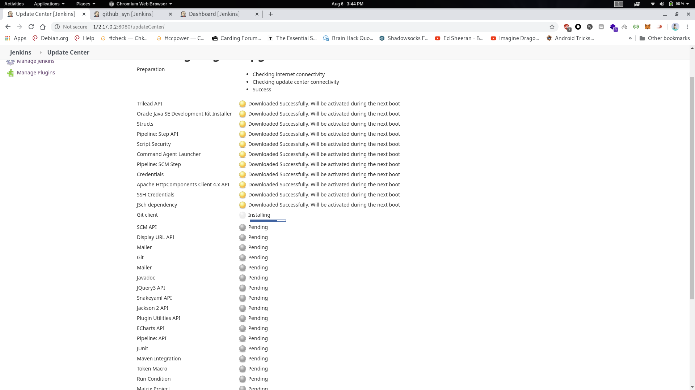

# Jenkins_automation_project2
**Aim**
Create container image that’s has Jenkins installed  using dockerfile 
When we launch this image, it should automatically starts Jenkins service in the container.
Create a job chain of job1, job2, job3 and  job4 using build pipeline plugin in Jenkins 

**Job1 :** 
Pull  the Github repo automatically when some developers push repo to Github.

**Job2 :**

By looking at the code or program file, Jenkins should automatically start the respective language interpreter installed image container to deploy code ( eg. If code is of  PHP, then Jenkins should start the container that has PHP already installed ).

**Job3 :**
Test your app if it  is working or not.

**Job4 :**
if app is not working , then send email to developer with error messages.
Create One extra job job5 for monitor : If container where app is running. fails due to any reson then this job should automatically startthe container again.

***Creating jenkins DockerFile**

**Creating image form DockerFile**

**Starting jenkins docker image**
In this step we link docker from continer to base system

**Installing Required extensions**

**Getting Ip and fire up the browser**

**Getting the Initial Password**

**Initial Page**

**Job1 GitSync Job**

**Job2 **

**Job3**

**Job4 Email job**

**Result**

